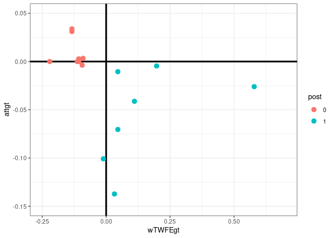
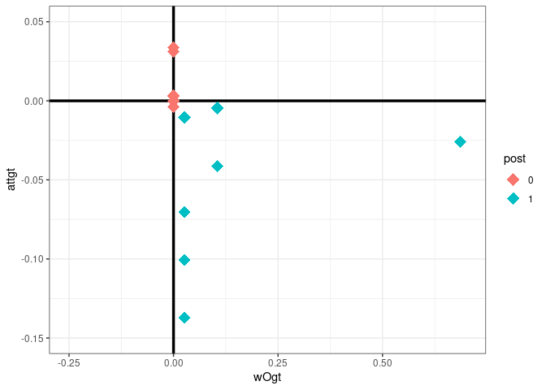
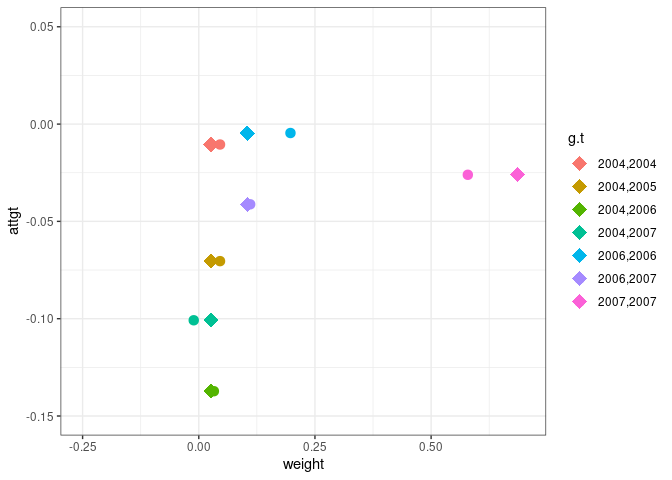

README
================

# twfeweights

`twfeweights` is an R package to compute implicit weights from using
two-way fixed effects (TWFE) regressions in the context of causal
inference with panel data.

The package currently includes functions to compute implicit weights
for:

- TWFE regressions with staggered treatment adoption

- TWFE regressions with staggered treatment adoption that include
  covariates (in progress)

- Weighted averages into overall average treatment effects and simple
  overall average treatment effects, as discussed in
  \[@callaway-santanna-2021\]

## Installation

``` r
library(twfeweights)
library(did)
library(fixest)
library(ggplot2)
data(mpdta)
mpdta$post <- 1*( (mpdta$year >= mpdta$first.treat) & (mpdta$treat==1) )

# compute ATT(g,t)
attgt <- did::att_gt(yname="lemp",
                idname="countyreal",
                gname="first.treat",
                tname="year",
                data=mpdta,
                control_group="nevertreated",
                base_period="universal")
summary(attgt)
```

    ## 
    ## Call:
    ## did::att_gt(yname = "lemp", tname = "year", idname = "countyreal", 
    ##     gname = "first.treat", data = mpdta, control_group = "nevertreated", 
    ##     base_period = "universal")
    ## 
    ## Reference: Callaway, Brantly and Pedro H.C. Sant'Anna.  "Difference-in-Differences with Multiple Time Periods." Journal of Econometrics, Vol. 225, No. 2, pp. 200-230, 2021. <https://doi.org/10.1016/j.jeconom.2020.12.001>, <https://arxiv.org/abs/1803.09015> 
    ## 
    ## Group-Time Average Treatment Effects:
    ##  Group Time ATT(g,t) Std. Error [95% Simult.  Conf. Band]  
    ##   2004 2003   0.0000         NA            NA          NA  
    ##   2004 2004  -0.0105     0.0238       -0.0739      0.0529  
    ##   2004 2005  -0.0704     0.0319       -0.1552      0.0144  
    ##   2004 2006  -0.1373     0.0382       -0.2390     -0.0356 *
    ##   2004 2007  -0.1008     0.0344       -0.1923     -0.0093 *
    ##   2006 2003  -0.0038     0.0316       -0.0877      0.0802  
    ##   2006 2004   0.0028     0.0193       -0.0486      0.0541  
    ##   2006 2005   0.0000         NA            NA          NA  
    ##   2006 2006  -0.0046     0.0167       -0.0491      0.0399  
    ##   2006 2007  -0.0412     0.0209       -0.0968      0.0143  
    ##   2007 2003   0.0033     0.0257       -0.0650      0.0717  
    ##   2007 2004   0.0338     0.0216       -0.0237      0.0913  
    ##   2007 2005   0.0311     0.0192       -0.0199      0.0821  
    ##   2007 2006   0.0000         NA            NA          NA  
    ##   2007 2007  -0.0261     0.0169       -0.0710      0.0189  
    ## ---
    ## Signif. codes: `*' confidence band does not cover 0
    ## 
    ## P-value for pre-test of parallel trends assumption:  0.16812
    ## Control Group:  Never Treated,  Anticipation Periods:  0
    ## Estimation Method:  Doubly Robust

``` r
# compute TWFE estimate
fixest::feols(lemp ~ post | countyreal + year, cluster="countyreal", data=mpdta)
```

    ## OLS estimation, Dep. Var.: lemp
    ## Observations: 2,500
    ## Fixed-effects: countyreal: 500,  year: 5
    ## Standard-errors: Clustered (countyreal) 
    ##       Estimate Std. Error  t value Pr(>|t|)    
    ## post -0.036549   0.013265 -2.75526 0.006079 ** 
    ## ---
    ## Signif. codes:  0 '***' 0.001 '**' 0.01 '*' 0.05 '.' 0.1 ' ' 1
    ## RMSE: 0.124223     Adj. R2: 0.991505
    ##                  Within R2: 0.004169

``` r
# compute TWFE weights
tw <- twfe_weights(attgt)
tw
```

    ##       G   TP      wTWFEgt        attgt
    ## 1     0 2003  0.297473170  0.000000000
    ## 2     0 2004  0.195248713  0.000000000
    ## 3     0 2005  0.195248713  0.000000000
    ## 4     0 2006 -0.009200201  0.000000000
    ## 5     0 2007 -0.678770395  0.000000000
    ## 6  2004 2003 -0.113075467  0.000000000
    ## 7  2004 2004  0.045719806 -0.010503246
    ## 8  2004 2005  0.045719806 -0.070423158
    ## 9  2004 2006  0.032486866 -0.137258739
    ## 10 2004 2007 -0.010851010 -0.100811363
    ## 11 2006 2003 -0.093821541 -0.003769294
    ## 12 2006 2004 -0.107054480  0.002750819
    ## 13 2006 2005 -0.107054480  0.000000000
    ## 14 2006 2006  0.197303127 -0.004594607
    ## 15 2006 2007  0.110627374 -0.041224472
    ## 16 2007 2003 -0.090576162  0.003306357
    ## 17 2007 2004 -0.133914039  0.033813012
    ## 18 2007 2005 -0.133914039  0.031087119
    ## 19 2007 2006 -0.220589792  0.000000000
    ## 20 2007 2007  0.578994032 -0.026054411

``` r
twfe_alp <- sum(tw$wTWFEgt * tw$attgt)
twfe_alp
```

    ## [1] -0.03654894

``` r
sum(tw$wTWFEgt[tw$post==1] * tw$attgt[tw$post==1])
```

    ## [1] 0

``` r
# drop untreated group
tw <- tw[tw$G != 0,]
tw$post <- as.factor(1*(tw$TP >= tw$G))
sum(tw$wTWFEgt[tw$post==1])
```

    ## [1] 1

``` r
ggplot(data=tw,
       mapping=aes(x=wTWFEgt, y=attgt, color=post)) +
  geom_hline(yintercept=0, linewidth=1.2) +
  geom_vline(xintercept=0, linewidth=1.2) + 
  geom_point(size=3) +
  theme_bw() +
  ylim(c(-.15,.05)) + xlim(c(-.25,.7))
```

<!-- -->

``` r
wO <- attO_weights(attgt)
wO <- wO[wO$G != 0,]
wO$post <- as.factor(1*(wO$TP >= wO$G))
sum(wO$wOgt * wO$attgt)
```

    ## [1] -0.03101828

``` r
ggplot(data=wO,
       mapping=aes(x=wOgt, y=attgt, color=post)) +
  geom_hline(yintercept=0, linewidth=1.2) +
  geom_vline(xintercept=0, linewidth=1.2) + 
  geom_point(shape=18, size=5) +
  theme_bw() +
  ylim(c(-.15,.05)) + xlim(c(-.25,.7))
```

<!-- -->

``` r
# plot the difference between the weights in post-treatment periods
plot_df <- cbind.data.frame(tw, wOgt=wO$wOgt)
plot_df <- plot_df[plot_df$post==1,]
sapply(unique(plot_df$G), function(g) mean(subset(plot_df, G==g)$wTWFEgt))
```

    ## [1] 0.02826887 0.15396525 0.57899403

``` r
plot_df$g.t <- as.factor(paste0(plot_df$G,",",plot_df$TP))

ggplot(plot_df, aes(x=wTWFEgt, y=attgt, color=g.t)) +
  geom_point(size=3) +
  theme_bw() +
  ylim(c(-.15,.05)) + xlim(c(-.25,.7)) +
  geom_point(aes(x=wOgt), shape=18, size=5) +
  xlab("weight")
```

<!-- -->
